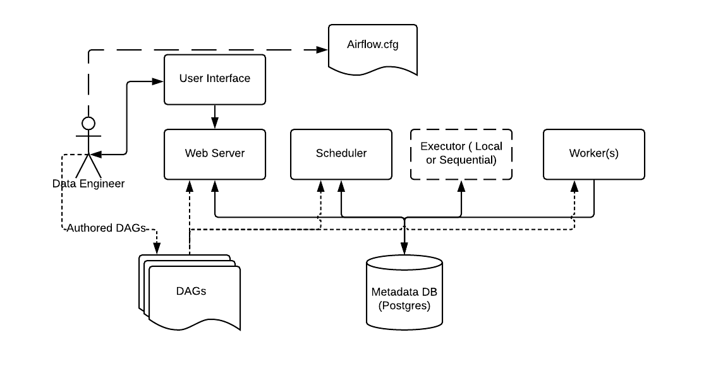

# Estructura de un DAG (Grafo Acíclico Dirigido) en Apache Airflow

Para entender la estructura de un DAG (Grafo Acíclico Dirigido) en Apache Airflow, lo mejor es pensar en él como el plano arquitectónico de tus datos: define qué se ejecuta, en qué orden y qué pasa si algo falla. En Airflow, el Scheduler lee tus archivos DAG de Python y coordina las tareas que ejecutarán los Workers.


Arquitectura de Airflow: Los DAGs son leídos por el Scheduler y el Web Server. Fuente: Apache Airflow - Apache Software Foundation

https://airflow.apache.org/docs/apache-airflow/2.0.1/concepts.html

## El Escenario: Pipeline ETL con AWS

Vamos a construir un pipeline clásico y muy práctico:

1. **Extract:** Detectar y descargar un archivo JSON crudo desde un bucket de Amazon S3.

2. **Transform:** Ejecutar un job de AWS Glue (o Spark) para limpiar los datos y convertirlos a formato Parquet (más eficiente).

3. **Load:** Registrar los datos transformados en Amazon Redshift (o Snowflake) para que el equipo de analítica pueda consumirlos.

## Paso a Paso para Estructurar el DAG

Para que tu código sea limpio y escalable, todo DAG de producción debe seguir estrictamente este orden de construcción:

### 1. Importar Librerías y Operadores: Cabecera del archivo.
Importas el núcleo de Airflow (DAG) y los conectores específicos de tu proveedor (en este caso, proveedores oficiales de AWS como S3Sensor, GlueJobOperator, etc.).

#### 2. Definir Argumentos por Defecto (default_args): Configuración de reintentos.
Creas un diccionario con las políticas globales de las tareas: quién es el dueño, cuántas veces reintentar si falla (retries) y cuánto esperar entre intentos.

#### 3. Instanciar el DAG: Context Manager.
Defines el ID único del DAG, su frecuencia de ejecución (schedule_interval) y la fecha de inicio (start_date). Usamos el contexto with de Python.

#### 4. Declarar las Tareas (Tasks): Bloques de construcción.
Instancias los operadores dentro del contexto del DAG. Cada operador se convierte en un nodo del grafo.

#### 5. Establecer el Flujo de Dependencias:Las flechas del grafo.

Usas los operadores de flujo (>>) al final del archivo para conectar las tareas en orden secuencial o paralelo.

## El Código del Pipeline
Aquí tienes la estructura limpia y real utilizando las mejores prácticas de Airflow modernos:
````Python
from datetime import datetime, timedelta
from airflow import DAG
# Importamos los operadores oficiales del proveedor de AWS
from airflow.providers.amazon.aws.sensors.s3 import S3KeySensor
from airflow.providers.amazon.aws.operators.glue import GlueJobOperator
from airflow.providers.amazon.aws.operators.redshift_data import RedshiftDataOperator

# 1. Configuración de reintentos y alertas
default_args = {
    'owner': 'data_team',
    'depends_on_past': False,
    'email_on_failure': True,
    'email': ['alertas_data@tuempresa.com'],
    'retries': 2,
    'retry_delay': timedelta(minutes=5),
}

# 2. Instanciamos el contenedor del DAG
with DAG(
    dag_id='aws_etl_pipeline_v1',
    default_args=default_args,
    description='Pipeline ETL mensual: S3 -> Glue -> Redshift',
    schedule_interval='@monthly',  # Se ejecuta el primero de cada mes
    start_date=datetime(2026, 1, 1),
    catchup=False,  # Evita ejecutar meses pasados al activar el DAG
    tags=['aws', 'etl', 'analytics'],
) as dag:

    # Tarea 1: El "Sensor" espera a que el archivo crudo llegue a S3
    esperar_archivo_s3 = S3KeySensor(
        task_id='esperar_archivo_s3',
        bucket_name='mi-bucket-landing-zone',
        bucket_key='raw/ventas/ventas_*.json',
        aws_conn_id='aws_default',  # ID de la conexión configurada en la UI de Airflow
        poke_interval=60,            # Revisa cada 60 segundos
        timeout=3600,                # Se rinde después de 1 hora
    )

    # Tarea 2: AWS Glue toma el JSON, lo procesa y lo guarda en Parquet
    transformar_datos_glue = GlueJobOperator(
        task_id='transformar_datos_glue',
        job_name='glue_clean_sales_data',
        script_location='s3://mi-bucket-scripts/glue_jobs/clean_sales.py',
        aws_conn_id='aws_default',
    )

    # Tarea 3: Cargar el resultado en el Data Warehouse (Redshift)
    cargar_a_redshift = RedshiftDataOperator(
        task_id='cargar_a_redshift',
        cluster_identifier='redshift-cluster-prod',
        database='dev',
        db_user='awsuser',
        sql="""
            COPY analytics.ventas 
            FROM 's3://mi-bucket-curated-zone/parquet/ventas/' 
            IAM_ROLE 'arn:aws:iam::123456789012:role/RedshiftS3Role'
            FORMAT AS PARQUET;
        """,
        aws_conn_id='aws_default',
    )

    # 3. Definición del flujo de trabajo (Pipeline)
    esperar_archivo_s3 >> transformar_datos_glue >> cargar_a_redshift
````

### Explicación de los Conceptos Clave

- `catchup=False`: Esto es vital en producción. Si pones el `start_date` en enero y hoy es mayo, Airflow por defecto intentará ejecutar de golpe 5 pipelines rezagados. Con `False`, solo le importa la ejecución de la fecha actual en adelante.
- `Sensores (S3KeySensor)` Son operadores especiales que no "hacen" nada más que esperar a que ocurra un evento externo (como la llegada de un archivo). Son clave para evitar que el pipeline falle porque los datos de origen no estaban listos.
- `Abstracción de Cómputo`: Nota que Airflow no procesa los datos. Airflow solo le dice a AWS Glue: "Oye, arranca tu motor de Spark y procesa esto". Dejar el trabajo pesado a AWS (o Snowflake/Databricks) es la regla de oro para que tu servidor de Airflow no se quede sin memoria.
- El operador `>>`: Conecta las tareas de izquierda a derecha. Si `esperar_archivo_s3` falla, el pipeline se detiene ahí y las tareas siguientes se marcan como `upstream_failed`, protegiendo la integridad de tu base de datos.